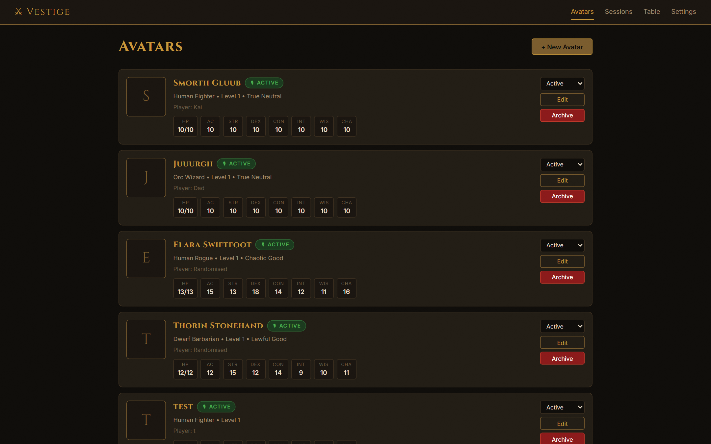
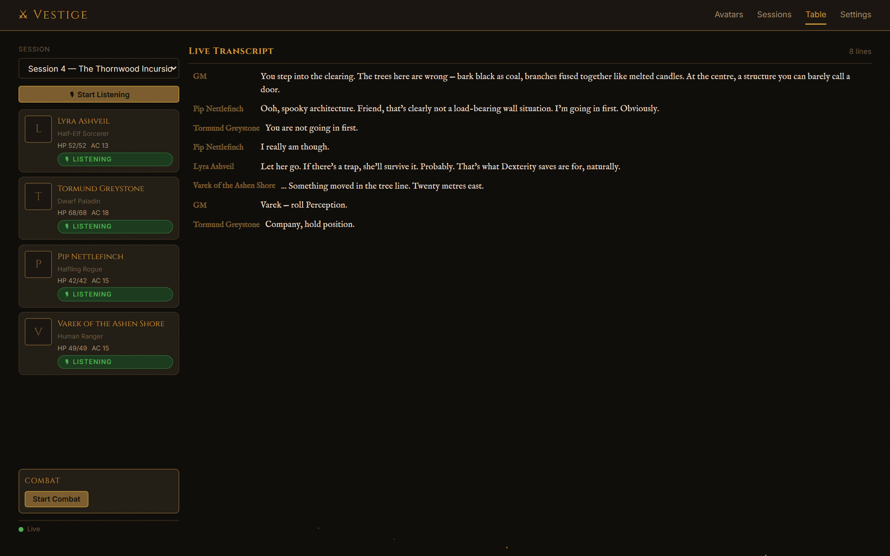
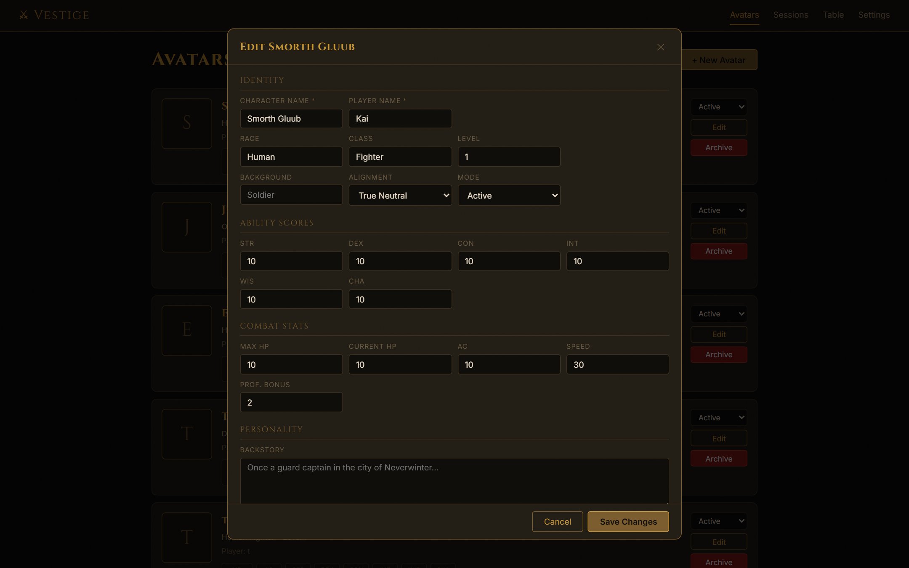
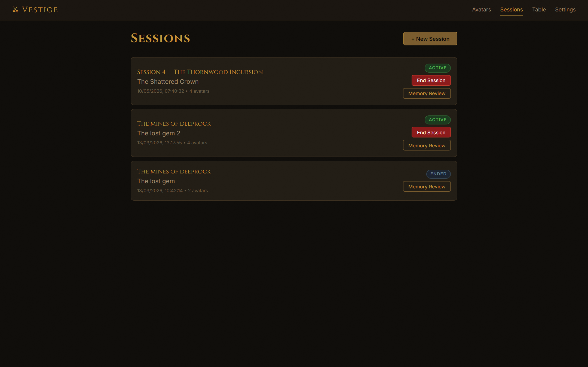
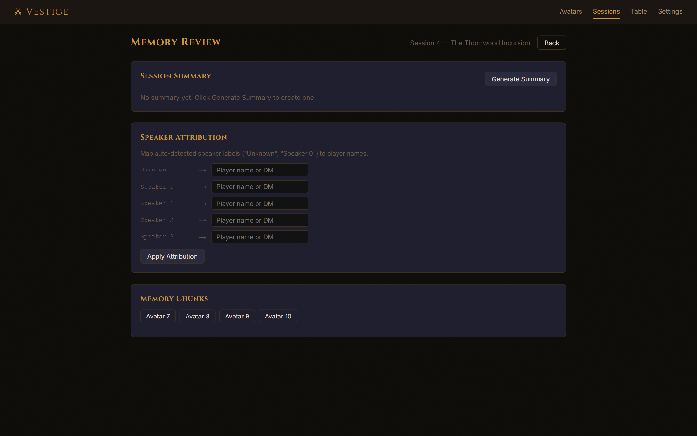

# Vestige

> AI-powered stand-ins for absent tabletop RPG players — locally hosted, fully voiced, and at the table without you pressing a single button.

---

## The Problem

You've spent three weeks on this session. The maps are drawn, the NPC names are on a sticky note above your monitor, and you've got a twist in act two that's genuinely going to land. Tuesday morning, the group chat lights up:

> *"So sorry — can we push? Baby's sick."*
> *"Ugh, same. Work is a nightmare this week."*
> *"Next week? Or the week after?"*
> *"I'm away the week after."*
> *"Week after that?"*
> *"I think I can do that...?"*

You've been having this conversation, with minor variations, for two years. You're on session seven.

This is not a scheduling problem. Scheduling problems get solved. This is a structural one — the older the group, the more life there is to get in the way. Kids, partners, mortgages (which is, honestly, a horror campaign of its own), shift work, travel. The sacred Wednesday night got moved to last-Sunday-of-the-month and the last four Sundays have all, somehow, each had something going on.

The classic workaround — "we'll just run your character as a goblin merchant for the session" — works once. It works with considerably less dignity when it's the same two people every time and the goblin merchant now has a name, a recurring arc, and the party trusts him more than the paladin.

**Vestige is the actual fix.** Create an avatar before the session — character sheet, personality, voice. When play starts, Vestige listens to the table through your microphone. It transcribes speech in real time, routes each utterance through a language model that knows the character intimately, and speaks the response back through the avatar's own voice. The rogue still makes the dry remark when the paladin does something reckless. The wizard still hesitates before agreeing to something morally questionable. The bard still tries to turn every fight into a negotiation.

No turn buttons. No prompts to type. The absent players are still at the table, in a way that matters.

---

## What Vestige Does

**Participates — doesn't wait to be poked.** Vestige evaluates every utterance, per avatar, and decides whether to respond based on personality archetype, cooldowns, and context. Extrovert characters join freely. Stoic characters wait until called. It feels like presence, not automation.

**Speaks in character, in voice.** Each avatar has an ElevenLabs voice. Emotion tags — `[tense]`, `[laughing]`, `[somber]` — are injected automatically by context. Combat sounds different from banter. Two TTS model tracks let you trade quality for speed.

**Remembers across sessions.** Transcripts are embedded and stored locally. Past promises, old grudges, and campaign milestones surface into context when relevant. Nothing is committed without GM review.

**Evolves over time.** A bad encounter with spiders leaves an arachnophobia that decays slowly over weeks. Betrayal creates distrust. These traits manifest in dialogue and voice when triggered.

**Stays local.** No accounts, no cloud sync. Everything runs on your machine. API calls go to Deepgram, ElevenLabs, OpenAI, and Anthropic — that's it.

---

## Screenshots



*The avatar roster — character sheets, archetype, and voice assignment for each absent player.*



*The live table view. Avatar panels on the left track HP, AC, and listening state. The transcript streams in real time on the right.*



*Character setup — full 5e sheet, backstory, and ElevenLabs voice tuning.*

| Sessions                                                | Memory Review                                                   |
| ------------------------------------------------------- | --------------------------------------------------------------- |
|  |     |

*Sessions list (left) and post-session memory review (right) — where Claude extracts trait and relationship changes for your approval.*

---

## Quick Start

### What you'll need

**Software:** Python 3.12+, Node.js 20+

**API keys** — pay-as-you-go; a 3-hour session costs roughly $2–5 total:

| Service | Used for | Sign up |
| ------- | -------- | ------- |
| [Deepgram](https://deepgram.com) | Streaming speech-to-text | deepgram.com |
| [ElevenLabs](https://elevenlabs.io) | Avatar voice synthesis | elevenlabs.io |
| [OpenAI](https://platform.openai.com) | Fast-path LLM (GPT-4o) | platform.openai.com |
| [Anthropic](https://console.anthropic.com) | Deep-path LLM + summariser (Claude) | console.anthropic.com |

> **No ElevenLabs yet?** Vestige falls back to Edge-TTS (free, Microsoft's voices) automatically. Good enough for testing; lower quality than ElevenLabs for actual play.

### 1. Clone and configure

```bash
git clone https://github.com/your-username/vestige.git
cd vestige
cp .env.example .env
# Edit .env — add your API keys
```

To find your microphone device index:

```bash
cd backend && python ../scripts/list_audio_devices.py
# Set MIC_DEVICE_INDEX in .env to the right device number
```

### 2. Backend

```bash
cd backend
python -m venv .venv

# Windows
.venv\Scripts\pip install -r requirements.txt

# macOS / Linux
source .venv/bin/activate && pip install -r requirements.txt

python -m alembic upgrade head
python -m uvicorn app.main:app --reload --port 8000
```

### 3. Frontend

```bash
cd frontend
npm install
npm run dev   # → http://localhost:5173
```

### 4. Create an avatar and start

1. Open [localhost:5173](http://localhost:5173) → **New Avatar**
2. Fill in the character sheet — personality, archetype, and voice suggestion are auto-generated on save
3. Paste a Voice ID from [elevenlabs.io/voice-lab](https://elevenlabs.io/voice-lab) in the Voice section (or leave blank for Edge-TTS)
4. **Sessions** → **New Session** → pick your avatars
5. **Table** → select the session → **Start Listening**
6. Talk. The avatars respond.

---

## Pages at a Glance

| Page | Route | What it's for |
| ---- | ----- | ------------- |
| Avatars | `/` | Create and manage your avatar roster |
| Sessions | `/sessions` | Create sessions, assign avatars, end them when done |
| Table | `/table` | Live game view — transcript, avatar panels, combat tracker, DM controls |
| Memory Review | `/sessions/:id/memory` | Post-session summary, trait and relationship changes, approval workflow |
| Settings | `/settings` | API keys, audio device, and all behaviour parameters |

---

## Going Deeper

| Doc | What's in it |
| --- | ------------ |
| [Features](docs/features.md) | How each system works: TTS emotion injection, avatar-to-avatar reactions, personality archetypes, trait evolution, LLM routing, memory retrieval |
| [Architecture](docs/architecture.md) | Full system diagram, data flow, component breakdown, project structure, key design decisions |
| [Configuration](docs/configuration.md) | Every `.env` variable, tuning parameter, and hot-reloadable YAML prompt file — with defaults and descriptions |

---

## Tech Stack

| Layer | Stack |
| ----- | ----- |
| Backend | Python 3.13, FastAPI 0.115, SQLAlchemy async + aiosqlite, Pydantic v2 |
| Frontend | React 19, Vite 7, Zustand, CSS Modules |
| Database | SQLite (aiosqlite) + sqlite-vec for embeddings |
| STT | Deepgram nova-3, streaming WebSocket |
| TTS | ElevenLabs streaming PCM · Edge-TTS fallback · XTTS-v2 local fallback |
| LLM — fast path | OpenAI GPT-4o |
| LLM — deep path | Anthropic Claude Sonnet 4.6 (prompt caching enabled) |
| Observability | Arize Phoenix (optional) |

---

## Tests

```bash
cd backend
.venv\Scripts\python -m pytest tests/ -v
```

305 tests. All pass on a clean install — no API keys required, all external calls are stubbed.
